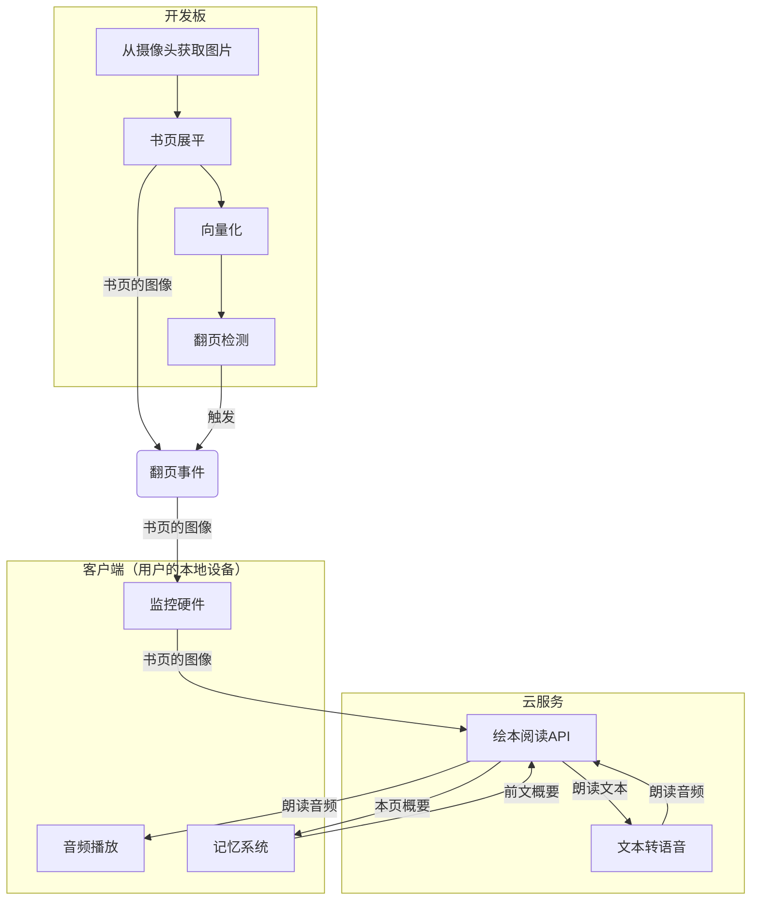

# AI驱动的绘本阅读机器人

## 项目架构

## 工作流程

### 启动阶段

（应用启动时执行一次）

1. 开发板广播蓝牙。
2. 客户端与开发板建立蓝牙连接（由用户手动操作）。
3. 客户端启动一个局域网服务。
4. 用户在客户端输入 WiFi 名、WiFi 密码（仅首次启动时获取，缓存，之后不用重复输入），客户端把 WiFi 名、WiFi 密码、客户端的局域网地址传给开发板。
5. 开发板连接 WiFi。
6. 开发板通过客户端的局域网地址，与客户端相连。之后的图像数据传输走这条线。

### 工作阶段

（启动后循环执行）

#### 硬件

开发板每隔 0.5 秒（具体间隔时间取决于硬件性能）执行一次：

1. 获取摄像头输入。
2. 从照片中提取书页并展平+向量化。
3. 通过当前向量与之前的向量比较，判断是否翻了页。
4. 如果翻页了，通过 WiFi 向客户端发送一个翻页事件，附带展平后的书页图像。

#### 客户端

客户端实时监听开发板传来的数据，如果触发了翻页事件：

1. 停止接收之前服务器还没传输完的音频，清空音频缓冲区，停止播放之前还没放完的音频。
2. 把书页图像、前文概要发送到服务器接口。
3. 从服务器接收这一页的数据：
    - 收到这一页的概要 → 存入记忆，下次请求时附带。
    - 收到要朗读的音频 → 把音频放入音频缓冲区。

客户端还要监控音频缓冲区的状态：

- 如果音频缓冲区里有待播放的音频，且当前不在播放音频，则从缓冲区里取出最老的音频并播放。

#### 服务端

服务器收到客户端发来的数据后：

1. 计算书页图像哈希，检查 cache。
    - cache 命中 → 直接返回概要和朗读音频
    - cache 未命中 → 2
2. 把书页图像传给视觉大模型，描述本页概要和朗读内容。
3. 返回本页概要给客户端。
4. 一旦攒满一句朗读内容（以标点分割），就立刻 TTS，并把得到的音频发送给客户端。直到朗读音频传输完。
    - 在此过程中，客户端可以随时打断传输。
5. 将本页概要、朗读内容、朗读音频存入 cache。