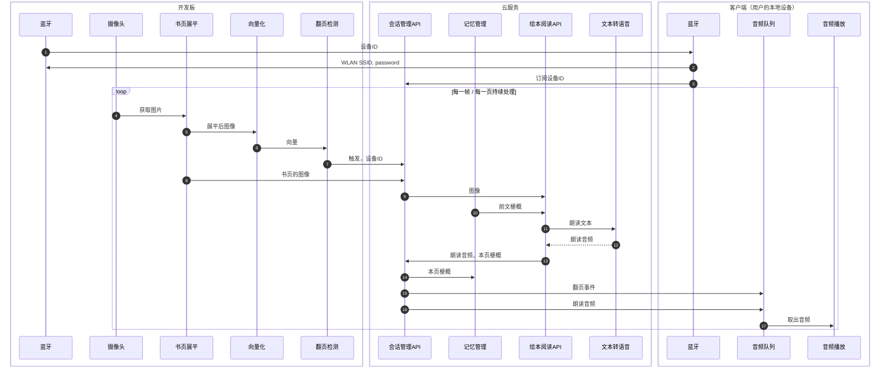

# AI驱动的绘本阅读机器人

## 工作流程

```mermaid
sequenceDiagram
    autonumber

    box 开发板
    	participant bluetooth as 蓝牙
        participant camera as 摄像头
        participant book_flatten as 书页展平
        participant vectorization as 向量化
        participant detect_page_turning as 翻页检测
    end

    box 云服务
        participant session as 会话管理API
        participant memory as 记忆管理
        participant picture_book_reading as 绘本阅读API
        participant TTS as 文本转语音
    end

    box 客户端（用户的本地设备）
    	participant bleak as 蓝牙
        participant audio_queue as 音频队列
        participant audio_player as 音频播放
    end

	bluetooth ->> bleak: 设备ID
	bleak ->> bluetooth: WLAN SSID, password
	bleak ->> session: 订阅设备ID

    loop 每一帧 / 每一页持续处理
        camera ->> book_flatten: 获取图片
        book_flatten ->> vectorization: 展平后图像
        vectorization ->> detect_page_turning: 向量

        detect_page_turning ->> session: 触发，设备ID
        book_flatten ->> session: 书页的图像
        session ->> picture_book_reading: 图像

        memory ->> picture_book_reading: 前文梗概
        picture_book_reading ->> TTS: 朗读文本
        TTS -->> picture_book_reading: 朗读音频

        picture_book_reading ->> session: 朗读音频、本页梗概
        session ->> memory: 本页梗概
		session ->> audio_queue: 翻页事件
        session ->> audio_queue: 朗读音频

        audio_queue ->> audio_player: 取出音频
    end
```

### 启动阶段

（应用启动时执行一次）

#### 硬件、客户端

1. 开发板广播蓝牙。
2. 客户端与开发板建立蓝牙连接（由用户手动选择要连接的对象）。
3. 开发板向客户端发送设备ID。
4. 用户在客户端输入 WiFi 名、WiFi 密码（仅首次启动时获取，缓存，之后仅需在访问不了 WLAN 时再次输入），客户端把 WiFi 名、WiFi 密码传给开发板。
5. 开发板连接 WiFi。
6. 开发板通过 WiFi 与服务端通信。之后的图像数据传输走这条线。
7. 客户端凭设备 ID 与服务端建立 SSE 连接，订阅传来的音频。

#### 服务端

- 读取数据库，构建 cache。

### 工作阶段

（启动后循环执行）

#### 硬件

开发板每隔大约 0.5 秒（具体间隔时间取决于硬件性能）执行一次：

1. 获取摄像头输入。
2. 从照片中提取书页并展平+向量化。
3. 通过当前向量与之前的向量比较，判断是否翻了页。
4. 如果翻页了，向服务端 API 发送书页图像、设备ID。

#### 客户端

客户端监听 SSE 事件：

- 如果从服务端发来音频 ID 或 URL，就把它下载下来，放入音频缓冲区队列。
- 如果从服务端发来翻页事件，就清空音频缓冲区，并停止播放正在播放的音频。

客户端还要监控音频缓冲区的状态：

- 如果音频缓冲区里有待播放的音频，且当前不在播放音频，则从缓冲区里取出最老的音频并播放。

#### 服务端

服务器收到客户端发来的数据后：

1. 向量化书页图像，检查 cache。
    - cache 命中 → 直接返回概要和朗读音频
    - cache 未命中 → 2
2. 从记忆模块取出该设备的前文梗概，把书页图像和前文梗概传给视觉大模型，描述本页概要和朗读内容。
3. 将本页概要存入记忆模块。
4. 向客户端发送翻页事件。
5. 一旦攒满一句朗读内容（以标点分割），就立刻 TTS，并把得到的音频发送给订阅该设备的客户端。直到朗读音频传输完。
6. 将本页概要、朗读内容、朗读音频存入 cache 和数据库。