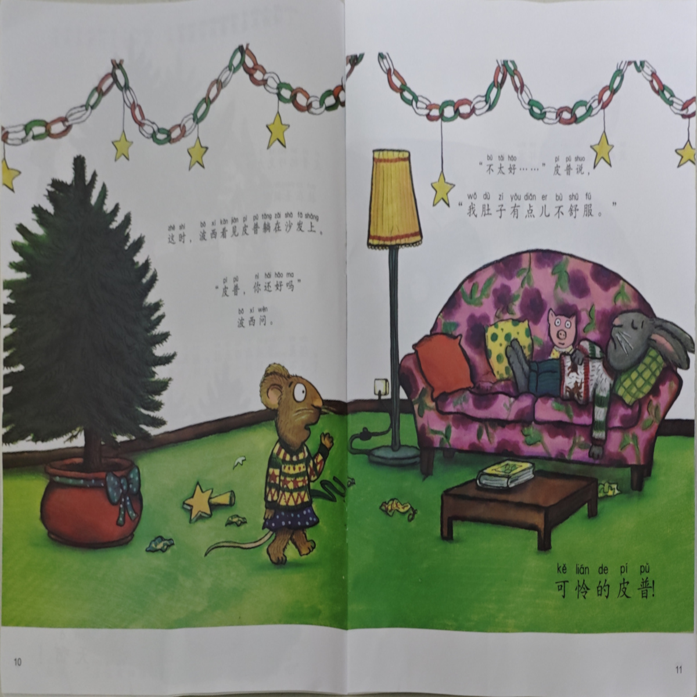
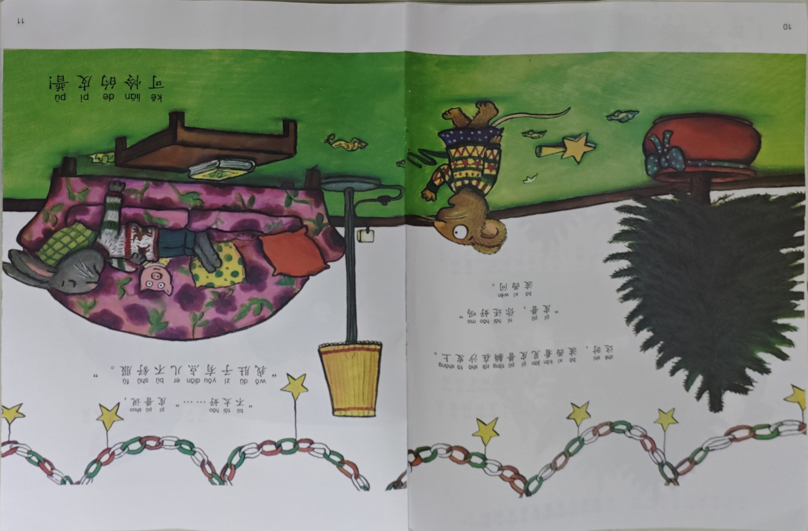
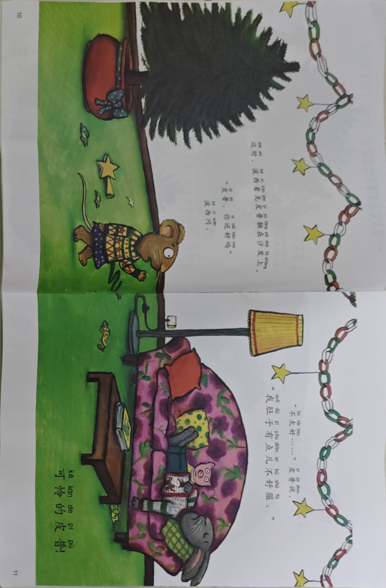

# 任务书-书页展平

用 Python 实现一个书页纠偏、展平函数。

给定一张照片，识别这幅图片中的书页，把它旋转、拉伸为长方形，输出处理后的书页。

## 函数签名

```python
def correct_paper(image_bytes: bytes) -> bytes
```

或其异步形式：

```python
async def correct_paper(image_bytes: bytes) -> bytes
```

## 参数

- `image_bytes` (bytes)：要处理的照片文件（字节），如：

    

## 返回值

处理后的图片文件（文件格式与输入相同），如：


对输出的长宽比不作要求，也就是说，输出这个也是可以的：



但是要确保图中的字清晰可认，因此建议输出的跟原照片尺寸一样吧。

对输出的旋转方向不作要求，也就是说，输出这个也是可以的：





## 输入特征

- 输入图片大小不超过 1600×1200 像素。
- 对于相邻的两个输入，它们的书本位置大概率是相近的。
- 图片格式：JPG / PNG

## 要求

- Python 版本：3.12

- 允许使用第三方库（如 OpenCV、Pillow、numpy 等）

- 不能本地部署大模型

- 性能：在单核 CPU 上：

    - 对大量输入的均摊运行时间 $\leq 0.4$ 秒。

    - 单次调用的最大运行时间 $\leq 1$ 秒。

- 允许预处理、构建缓存等。

暂时先不考虑运行时内存吧。

## 调用示例

```python
import os
os.mkdir("output")

image_paths = [
    "image_1.png",
    "image_2.png",
    ...,
    "image_9999.png"
]

for image_path in image_paths:
    with open(image_path, mode="rb") as file:
        image_bytes = file.read()

    corrected_image_bytes = correct_paper(image_bytes)

    with open(f"output/{image_path}", mode="wb") as file:
        file.write(corrected_image_bytes)

```

## 提交方式

自己创建一个 GitHub 仓库，README 里写清楚运行耗时、效果图、调用方式等。把仓库链接发群里。